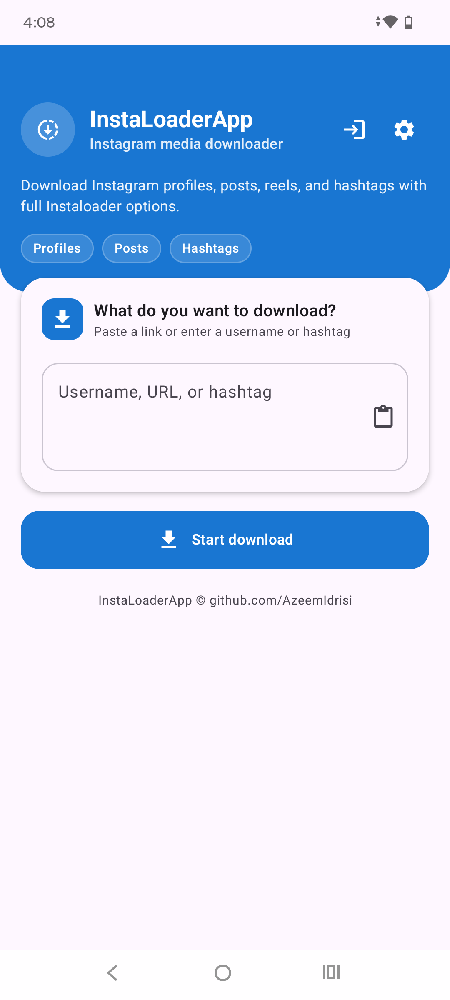
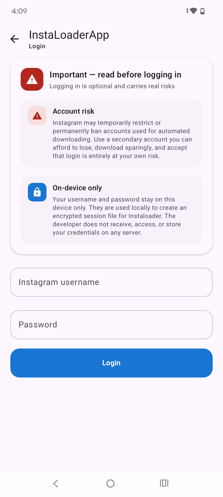
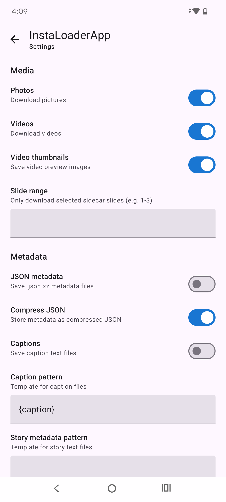

<div align="center">

# InstaLoaderApp

### Bulk Instagram media downloader for Android.

Download profiles, posts, reels, and hashtags using [`instaloader`](https://github.com/instaloader/instaloader) — with live progress, full CLI options, and optional login.


</div>

## Overview

**InstaLoaderApp** uses Jetpack Compose, foreground downloads with notifications, and instaloader 4.15.1 via Chaquopy. Files save to **`Downloads/InstaLoaderApp/`** by default (changeable in Settings → Storage).

> [!TIP]
> Login is optional — only needed for private content, stories, highlights, or comments.

---

## Screenshots

<div align="center">





</div>

---

## Features

- Profiles, single post/reel URLs, and hashtags
- Live progress (done / left / failed) + notification
- Full Instaloader settings (media, metadata, filters, naming, resume)
- Optional login with 2FA; on-device only (session file in private app storage, username in encrypted settings)
- Public download folder + custom location presets

---

## Installation

[](https://github.com/AzeemIdrisi/InstaLoaderApp/releases/latest)

Install the APK, then on first download grant **All files access** (Android 11+) and **Notifications** (Android 13+) when prompted.

---

## Usage

| Input           | Example                     | Output folder                             |
| --------------- | --------------------------- | ----------------------------------------- |
| Username        | `instagram`                 | `Downloads/InstaLoaderApp/<username>/`    |
| Post / reel URL | `https://instagram.com/p/…` | `Downloads/InstaLoaderApp/posts/`         |
| Hashtag         | `#travel`                   | `Downloads/InstaLoaderApp/hashtag_<tag>/` |

1. Enter a username, URL, or hashtag → **Start download**.
2. For posts/reels, copy the link from Instagram and paste into the app.

> [!WARNING]
> Large profiles can take a long time. Instagram may restrict accounts used for automated downloading — use a secondary account at your own risk if you log in.

---

## Build from source

```
git clone https://github.com/AzeemIdrisi/InstaLoaderApp.git
cd InstaLoaderApp
```

Set `sdk.dir` in `local.properties`, then:

```
./gradlew installDebug
```

Requires Android Studio, JDK 17, and Python 3 for Chaquopy. See `app/build.gradle` for `buildPython` path.

---

## Disclaimer

Use responsibly. Download only content you may access. The developer is not responsible for misuse. Credentials never leave your device.

Licensed under [GPL-3.0](LICENSE). Contributions welcome via pull request.

---

## Developer

<a href="https://github.com/azeemidrisi/">
 
</a>

**Azeem Idrisi** - [@AzeemIdrisi](https://github.com/azeemidrisi/)

### Contributors

Special thanks to all the contributors :

[@noobshubham](https://github.com/noobshubham/)

[@PuruSinghvi](https://github.com/PuruSinghvi)

<a href="https://paypal.me/AzeemIdrisi" target="_blank"></a>
<a href="https://www.buymeacoffee.com/AzeemIdrisi" target="_blank"></a>

<hr>

Copyright © 2026 Azeem Idrisi ([github.com/AzeemIdrisi](https://github.com/AzeemIdrisi))
